+++
title = 'Parking Game Fuzzer'
date = '2026-06-27T00:50:37-07:00'
draft = false
math = true
+++

## Parking game fuzzer notes (can be used as secondary fuzzing notes)

[https://github.com/h4ck0lympus/parking-game-fuzzer](https://github.com/h4ck0lympus/parking-game-fuzzer)

## 1. The Core Fuzzing Loop

At the highest level, a mutational fuzzer repeats:

```text
choose parent
->mutate parent
->execute candidate
->observe result
->decide whether to preserve it
->repeat
```

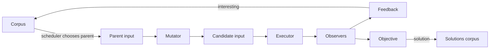

Conceptual pseudocode:

```text
while no solution:
    parent = scheduler.choose(corpus)
    candidate = mutator.mutate(parent)
    exit_kind = executor.run(candidate)
    observations = observers.results()

    if objective.is_interesting(observations, exit_kind):
        solutions.add(candidate)

    if feedback.is_interesting(observations, exit_kind):
        corpus.add(candidate)
```

The central LibAFL idea is that each responsibility is represented by a component and trait that can be replaced independently.

## 2. LibAFL Component Map

| Component | Main question |
|--|--|
| `Input` | What object is being mutated? |
| `State` | What persistent information does the fuzzer own? |
| `Scheduler` | Which corpus testcase becomes the next parent? |
| `Mutator` | How is the parent changed? |
| `Executor` | How is the candidate run? |
| `Observer` | What happened during execution? |
| `Feedback` | Should this candidate enter the corpus? |
| `Objective` | Is this candidate a solution? |
| `Stage` | What operations happen during one fuzzing iteration? |
| `EventManager` | How are statistics and events reported? |
| `Testcase metadata` | What persistent information belongs to one saved input? |
| `State metadata` | What persistent information belongs to the whole campaign? |

Important distinction:

```text
Corpus testcase metadata:
    belongs to one saved input

State metadata:
    belongs to the entire fuzzing campaign
```

Examples:

```text
ViewMetadata:
    legal moves for one saved board state

FinalStateMetadata:
    complete snapshot for one saved board state

CrashRateMetadata:
    global crash count for the whole session
```

## 3. The Parking-Game Input Model

The fuzzer input is a small domain-specific program:

```rust
pub struct PGInput {
    moves: Vec<(NonZeroUsize, Direction)>,
}
```

Each element means:

```text
(car number, one-square direction)
```

Example:

```text
(car 2, Right)
(car 2, Right)
(car 4, Down)
```

This means:

```text
move car 2 right by one square
move car 2 right by one square
move car 4 down by one square
```

**The important mindset is:**

> The fuzzer is not mutating arbitrary bytes. It is mutating a sequence of semantic actions.

## 4. Executor Responsibilities

The executor receives:

```rust
input: &PGInput
```

and applies those moves to a parking-game state.

Conceptual behavior:

```text
choose starting game state
->apply moves in order
->invalid move?
    yes: return ExitKind::Crash
    no: send final board to observers
->return ExitKind::Ok
```

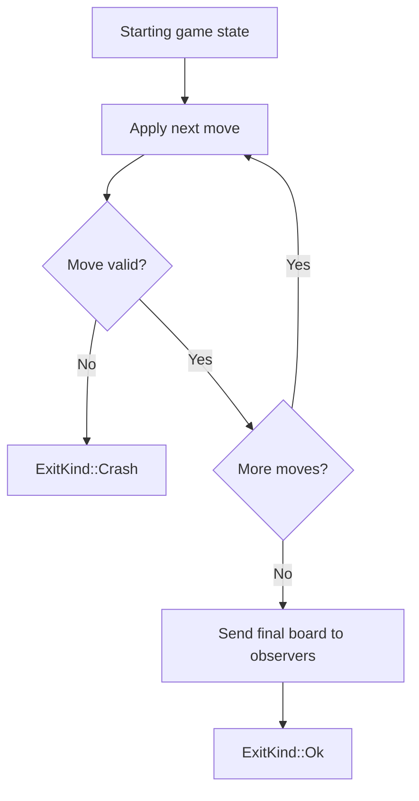

A naming hazard:

```text
state: &mut S
    LibAFL state

State<T>
    parking-game state
```

Mentally rename them:

```text
libafl_state
game_state
```

LibAFL state contains:

```text
RNG
corpus
solutions
metadata
current testcase
execution count
```

Parking-game state contains:

```text
board
cars
positions
```

## 5. Observers Are Temporary Per-Execution Data

### `FinalStateObserver`

Stores the final board state after a successful execution.

Used for:

- hashing the resulting board,
- detecting a new board state,
- saving snapshots later.

### `ViewObserver`

For every car, records:

- backward direction,
- forward direction,
- distance before collision,
- nearest obstacle.

Example:

```text
car 3:
    backward = Left, distance 2, obstacle wall
    forward  = Right, distance 1, obstacle car 5
```

Observer lifecycle:

```text
pre_exec()
    clears old data

executor runs

final_board()
    fills observations for this execution
```

This means:

> Observer data is temporary and does not automatically remain associated with a corpus input.

## 6. Nested `Option` and Board Lookup

A key Rust/data-model lesson came from:

```rust
board.get(position)
```

Its effective type was:

```rust
Option<Option<NonZeroUsize>>
```

Interpret the layers separately:

```text
None
    coordinate is outside the board

Some(None)
    coordinate exists, but the square is empty

Some(Some(car))
    coordinate exists and contains a car
```

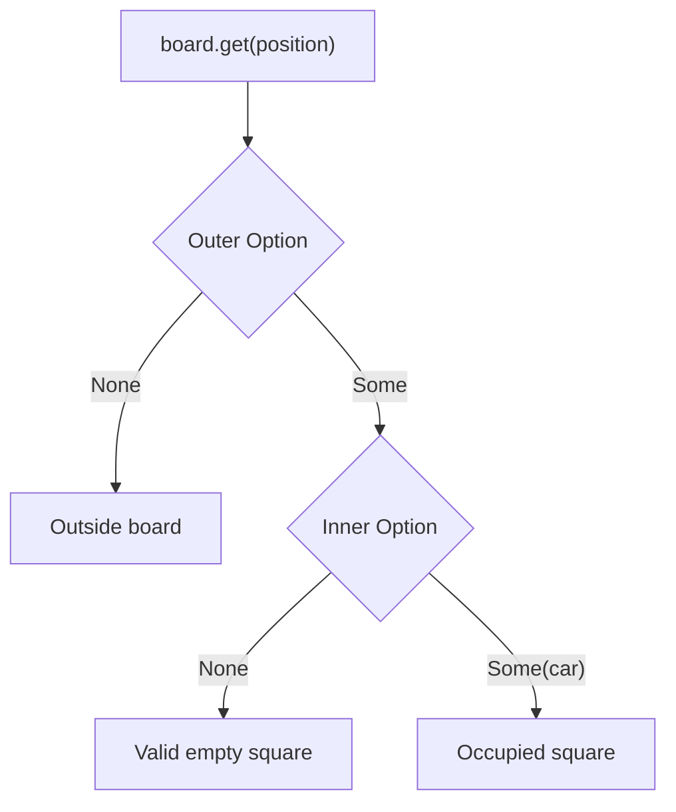

General rule:

> Before using `unwrap()` on `Option`, `Result`, or nested enums, enumerate every possible variant.

If a case is expected control flow, it should not be handled with `unwrap()`.

## 7. `step_until_seen` and Off-by-One Reasoning

The goal is to find:

- the nearest obstacle,
- the number of legal one-square moves before collision.

For each direction:

```text
inspect next relevant square
->outside board: wall
->empty: increment distance and continue
->occupied: return obstacle and distance
```

Definition:

> An immediately adjacent obstacle has distance zero.

Example:

```text
oo2
```

The objective car cannot move right:

```text
distance = 0
```

Example:

```text
oo.2
```

It can move once:

```text
distance = 1
```

A bug appeared when both `offset` and `distance` were added to the coordinate while both were incremented. That skipped cells.

A veteran debugging method for coordinate loops:

1. Write down the first three iterations.
2. Track each variable in a table.
3. Verify no cell is skipped or revisited unexpectedly.
4. Test the adjacent-obstacle case.
5. Test the wall case.
6. Test one and multiple empty cells.

## 8. Feedback Has Two Separate Jobs

A LibAFL `Feedback` may participate in two phases.

### Decision phase

```rust
is_interesting(...)
```

Question:

```text
Should this candidate enter the corpus?
```

### Metadata phase

```rust
append_metadata(...)
```

Question:

```text
Now that LibAFL has decided to preserve this candidate,
what information should be attached to the real testcase?
```

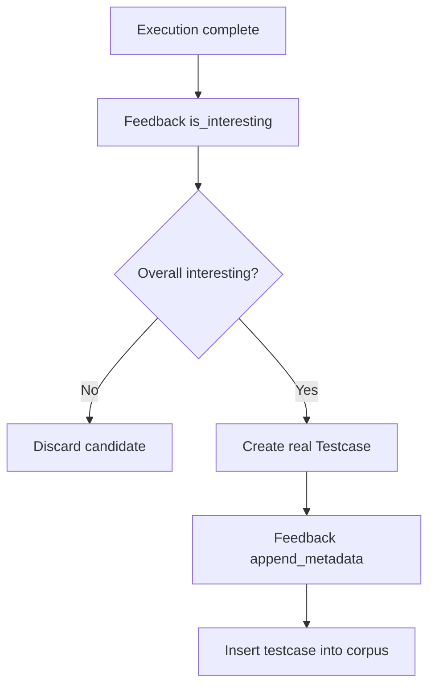

Critical lesson:

> Do not create a temporary local `Testcase` inside `is_interesting` and attach metadata to it. That temporary object is dropped and is not the testcase LibAFL stores.

## 9. Producer–Consumer Metadata Pattern

### Part 2: Legal-move metadata

```text
ViewObserver
    produces temporary legal-move information

ViewFeedback
    copies it into ViewMetadata on the saved testcase

PGTailMutator
    consumes ViewMetadata from the selected parent testcase
```

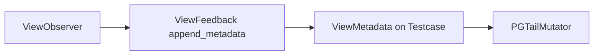

### Part 3: Snapshot metadata

```text
FinalStateObserver
    produces temporary final State<T>

FinalStateFeedback
    copies it into FinalStateMetadata on the saved testcase

PGExecutor
    consumes FinalStateMetadata to restore a parent snapshot
```


General rule:

> Whenever a component reads metadata, find the component responsible for writing it.

Useful repository searches:

```bash
rg "add_metadata"
rg "metadata::<"
rg "metadata_mut::<"
rg "append_metadata"
```

## 10. Corpus Metadata vs State Metadata

### Testcase metadata

Stored on one corpus entry:

```text
Testcase
├── input: PGInput
└── metadata
    ├── ViewMetadata
    └── FinalStateMetadata
```

### State metadata

Stored globally:

```text
StdState
└── metadata
    └── CrashRateMetadata
```

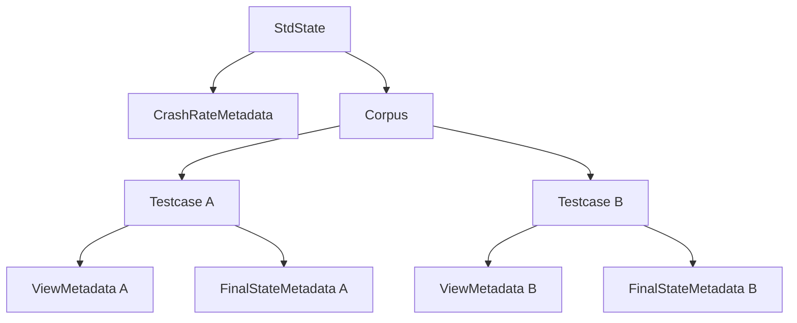

Use testcase metadata when information is specific to one saved input.

Use state metadata when information belongs to the whole fuzzing session.

## 11. CrashRateFeedback

Its responsibility:

```text
count executions classified as Crash
report crashes / executions
```

It does not decide corpus admission.

Correct conceptual behavior:

```text
if ExitKind::Crash:
    increment num_crashes

return false
```

Why false?

```text
CrashRateFeedback is a statistics collector,
not guidance.
```

If it returned true:

```text
invalid parking move
->considered interesting
->inserted into corpus
```

That is undesirable.

### Metadata initialization

```rust
#[derive(Debug, Clone, Deserialize, Serialize, Default)]
pub struct CrashRateMetadata {
    pub num_crashes: u64,
}
```

Its initializer inserts:

```text
CrashRateMetadata { num_crashes: 0 }
```

into LibAFL state metadata.

### Reporting

```text
crashes = CrashRateMetadata.num_crashes
executions = state execution counter
value = UserStatsValue::Ratio(crashes, executions)
```

Prefer `?` over `unwrap()` when the enclosing method already returns `Result`.

## 12. Feedback Composition: Boolean Logic Plus Side Effects

### Corpus guidance

The actual corpus-preservation rule:

```text
not crashed AND new final state
```

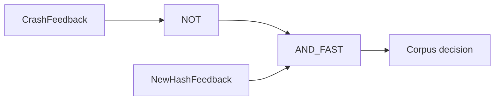

Why short-circuit AND?

```text
if execution crashed:
    do not inspect final-state observer
```

The observer may not contain a completed state after a crash.

### Objective

A solution should satisfy:

```text
not crashed AND solved
```

### Metadata/statistics feedbacks

These return false but perform useful work:

```text
CrashRateFeedback
ViewFeedback
FinalStateFeedback
```

The complete logic is:

```text
false OR false OR false OR valid_new_state
=
valid_new_state
```

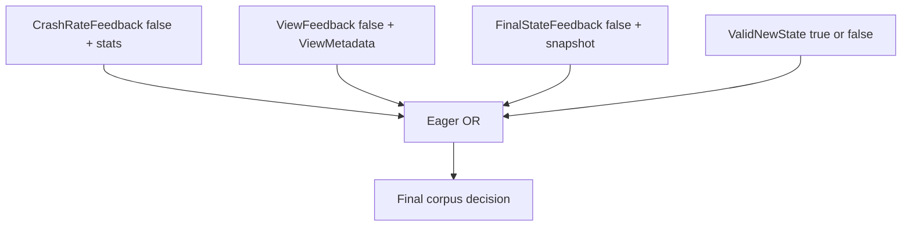

Important:

> In feedback composition, reason about both truth values and side effects.

Do not put a metadata-only feedback first in `AND_FAST`, because it returns false and may prevent the rest from executing.

## 13. Eager vs Short-Circuit Composition

### Short-circuit AND

```text
A && B
```

If `A` is false, skip `B`.

Use when:

- later feedback depends on successful execution,
- observer data may be absent on failure,
- skipping work is correct.

Example:

```text
not crashed AND_FAST new-state
```

### Eager OR

Evaluate all components.

Use when:

- statistics must be updated,
- metadata must be attached,
- components have required side effects.

Example:

```text
CrashRateFeedback
OR ViewFeedback
OR FinalStateFeedback
OR valid_new_state
```

General lesson:

> Framework combinators can alter which callbacks run, not merely the final Boolean result.

## 14. `PGRandMutator`

Behavior:

```text
choose random car
choose random direction
choose random insertion index
insert move
```

### Correct insertion-index domain

For a vector of length `n`, valid insertion indices are:

```text
0 through n inclusive
```

There are `n + 1` positions.

```text
[A, B, C]

0: before A
1: between A and B
2: between B and C
3: after C
```

Using the number of cars as the insertion bound was a semantic domain mismatch.

### Weaknesses

1. Only inserts moves.
2. Cannot delete bad moves.
3. Cannot replace bad moves.
4. Input length grows monotonically.
5. Ignores car orientation.
6. Ignores obstacles.
7. Frequently generates invalid moves.
8. Inserting in the middle can invalidate a previously valid suffix.
9. Cannot directly repair an earlier bad action.

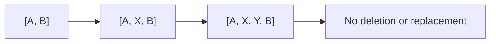

## 15. `PGTailMutator`

The tail mutator uses semantic metadata to append only valid moves.

### High-level algorithm

```text
borrow selected parent testcase
->read ViewMetadata
->enumerate all legal high-level choices
->release testcase borrow
->randomly choose one
->append the same one-square move distance times
```

A high-level choice:

```text
(car, direction, distance)
```

Example:

```text
(car 2, Right, 3)
```

becomes:

```text
(car 2, Right)
(car 2, Right)
(car 2, Right)
```

### Enumerating all choices

If a car can move left by three:

```text
(car, Left, 1)
(car, Left, 2)
(car, Left, 3)
```

Enumerate both:

```text
backward view
forward view
```

for every car.

### Choose one high-level movement

Do not choose several unrelated choices from the same old metadata.

Why?

```text
choice 1 changes the board
choice 2 was validated against the old board
choice 2 may no longer be valid
```

Instead:

```text
choose one legal movement
apply it for the selected distance
```

### Empty choices

If every car is blocked:

```text
choices.is_empty()
->MutationResult::Skipped
```

## 16. Borrowing Pattern in `PGTailMutator`

The testcase is borrowed from `state`.

While that borrow is alive, Rust will reject:

```rust
state.rand_mut()
```

because this requires mutable access to the same state.

Correct lifecycle:

```text
borrow testcase
->borrow ViewMetadata
->copy required information into owned Vec
->end testcase borrow
->access mutable RNG
```

A scope is cleaner than manual `drop`:

```rust
let choices = {
    let testcase = state.current_testcase()?;
    let metadata = testcase.metadata::<ViewMetadata<T>>()?;

    let mut choices = Vec::new();
    // build owned choices
    choices
};

// borrow ended here
// state.rand_mut() is legal
```

General Rust rule:

> Convert borrowed framework data into owned local data before releasing the borrow.

## 17. Snapshot Fuzzing

Snapshot fuzzing avoids replaying the unchanged parent prefix.

Suppose:

```text
parent:
[A, B, C]

candidate:
[A, B, C, D, D]
```

### Without snapshot

```text
initial board
->A
->B
->C
->D
->D
```

### With snapshot

```text
restore board after A, B, C
->D
->D
```

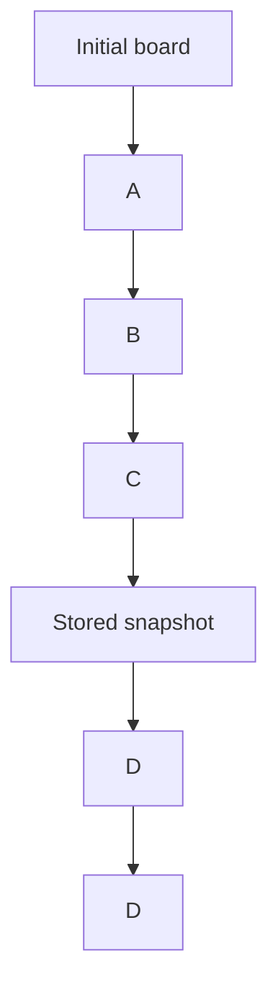

### Required invariant

The parent input must be a prefix of the candidate:

```text
candidate.starts_with(parent)
```

Otherwise:

```text
snapshot does not correspond to the candidate prefix
->illegal state
```

### Executor inputs

The executor uses:

```text
current testcase:
    parent input
    FinalStateMetadata snapshot

run_target input:
    mutated candidate
```

Its snapshot-selection block conceptually returns:

```text
(starting game state, moves still needing execution)
```

Fallback path:

```text
(initial state, all candidate moves)
```

Snapshot path:

```text
(parent snapshot, candidate suffix)
```

### Critical bug

After computing:

```rust
let (game_state, moves) = ...
```

the move loop must iterate over:

```text
moves
```

not:

```text
input.moves()
```

Otherwise the prefix is replayed on top of a state that already includes it.

## 18. `PGInput::is_prefix_of`

A useful helper expresses the domain invariant:

```text
parent.is_prefix_of(candidate)
```

Conceptually:

```text
candidate.moves.starts_with(parent.moves)
```

Then:

```text
prefix_len = parent.moves.len
suffix = candidate.moves[prefix_len..]
```

This is an example of improving code readability by turning a low-level slice comparison into a named domain operation.

## 19. Artificial Delay and Snapshot Measurement

The exercise adds:

```text
sleep one microsecond after each executed move
```

The delay belongs inside the move loop.

Without snapshots:

```text
100 prefix moves + 2 tail moves
= 102 delays
```

With snapshots:

```text
restore snapshot + 2 tail moves
= 2 delays
```

General benchmarking principle:

> Place artificial cost where the real repeated cost would occur.

## 20. Rust Concepts Encountered

### 20.1 `Option<T>` vs `&Option<T>`

Given:

```text
&Option<PGInput>
```

calling `.unwrap()` attempts to consume the `Option`.

Use:

```text
.as_ref()
```

to transform:

```text
&Option<T>
->Option<&T>
```

Then:

```text
Option<&T>
->&T
```

without moving the owned value.

### 20.2 `unwrap()` consumes its receiver

Approximate signature:

```text
unwrap(self) -> T
```

When the receiver is borrowed, ask whether ownership can legally move.

### 20.3 `Copy` vs `Clone`

Copy is appropriate for small scalar values:

```text
u8
u16
u64
many small enums
```

Clone is used for owned structures:

```text
PGInput
State<T>
Vec<T>
```

Do not clone when borrowing is enough.

### 20.4 Turbofish

```rust
metadata::<ViewMetadata<T>>()
```

The generic type tells Rust what metadata type to retrieve.

Correct:

```text
state.method::<Type>()
```

Incorrect:

```text
state::<Type>
```

### 20.5 Generic trait bounds

If generic `S` must support:

```text
metadata access
execution count
RNG access
current testcase access
```

the needed traits may include:

```text
HasMetadata
HasExecutions
HasRand
HasCurrentTestcase
```

Reusable method:

```text
Need to call method X on generic T
->find the trait defining X
->add T: ThatTrait
```

### 20.6 Tuple destructuring

If an iterator item is:

```text
(NonZeroUsize, &ViewFrom<T>)
```

write:

```rust
for (car, view_from) in metadata.views()
```

A tuple itself does not have `backward()` or `forward()` methods.

### 20.7 `Vec` methods

| Goal | Method |
|--|--|
| Add one element | `push(value)` |
| Insert at index | `insert(index, value)` |
| Move all items from another vector | `append(&mut other)` |
| Add items from an iterator | `extend(iter)` |

### 20.8 `()` is unit, not an empty collection

```rust
let choices = ();
```

creates unit.

Use:

```rust
Vec::new()
```

for a growable list.

### 20.9 Ignored expression results

This:

```rust
match x {
    ... => Ok(true)
}
Ok(false)
```

discards the result of the match and returns `Ok(false)`.

Always ask:

> Who consumes the value produced by this expression?

### 20.10 Closures for local control flow

The executor uses a closure so `return` can exit only the snapshot-selection block while returning:

```text
(game_state, moves)
```

The outer `?` propagates any error from the closure.

## 21. How to Read Rust Compiler Errors

### Step 1: Read only the first error

Later errors may be cascading consequences.

### Step 2: Extract expected and found types

Example:

```text
expected Testcase<PGInput>
found &_
```

Ask:

```text
What type did I explicitly demand?
What type did the method actually return?
```

### Step 3: Inspect method signatures

Use:

- IDE hover,
- Go to definition,
- local crate source,
- `cargo doc --open`.

### Step 4: Build a type ladder

Example:

```text
parent.input()
    &Option<PGInput>

.as_ref()
    Option<&PGInput>

.unwrap()
    &PGInput
```

### Step 5: Force a diagnostic when needed

```rust
let x: () = some_expression;
```

The compiler will report the real inferred type.

### Step 6: Treat clone suggestions cautiously

The compiler may suggest cloning because it resolves ownership.

Ask:

```text
Do I truly need ownership?
Would borrowing be sufficient?
```

## 22. Repository Navigation Workflow

Experienced engineers do not understand an entire large repository at once.

They isolate the smallest connected code path needed for the current question.

### Start with a concrete question

Too broad:

```text
How does this repository work?
```

Useful:

```text
Where does `moves` come from?
Who writes ViewMetadata?
Who calls append_metadata?
Which trait provides executions()?
```

### Trace backward

```text
Where did this value originate?
```

Example:

```text
moves
← input.moves()
← input: &PGInput
← executor argument
← mutator/test constructed candidate
```

### Trace forward

```text
Where does it go?
```

Example:

```text
moves
->executor loop
->board.shift_car
->observers
->feedback/objective
```

### Useful searches

```bash
rg "struct PGInput"
rg "impl PGInput"
rg "fn moves"
rg "PGInput::new"
rg "add_metadata"
rg "metadata::<"
rg "append_metadata"
rg "trait HasExecutions"
rg "\.executions()"
```

### Read tests early

Tests reveal:

- construction patterns,
- expected values,
- edge cases,
- intended wiring,
- lifecycle ordering.

### Build a repository map

```text
input.rs
    input representation

executor.rs
    execution semantics

observers.rs
    temporary execution data

feedbacks.rs
    guidance, objective support, metadata production

mutators.rs
    candidate generation

stages.rs
    fuzzing iteration behavior

main.rs
    component assembly
```

## 23. Separate Domain Logic from Framework Plumbing

Classify each line.

Example:

```text
input.moves()
    domain input access

board.shift_car(...)
    parking-game operation

state.metadata::<...>()
    LibAFL state plumbing

self.observers.final_board_all(...)
    observer framework integration

Ok(ExitKind::Crash)
    LibAFL execution classification
```

This prevents simultaneous confusion across:

```text
Rust language
LibAFL framework
parking-game rules
```

## 24. Form and Verify Hypotheses

A strong code-reading cycle:

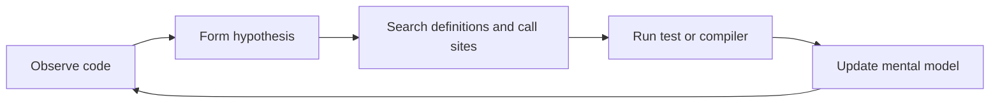

Example:

```text
Hypothesis:
final_board_all calls final_board on every observer.

Verification:
search final_board_all
inspect tuple recursion
run observer test
```

You do not need complete certainty before proceeding. You need a testable model.

## 25. Common Mistakes and General Lessons

### Using number of cars as insertion bound

Lesson:

```text
same primitive type does not imply same semantic domain
```

Prefer names such as:

```text
num_cars
num_moves
num_insertion_positions
```

### Counting `ExitKind::Ok` as a crash

Lesson:

```text
write a behavior table before the match
```

### Returning true from CrashRateFeedback

Lesson:

```text
an event occurred
≠
this feedback should preserve the input
```

### Attaching metadata to a temporary testcase

Lesson:

```text
find the framework-owned object that survives
```

### Expecting observer data to persist

Lesson:

```text
observers are temporary
testcase metadata is persistent
```

### Restoring a snapshot but replaying all moves

Lesson:

```text
verify downstream code actually uses the newly computed variable
```

### Using short-circuit AND with metadata-only feedback

Lesson:

```text
truth value and required side effects both matter
```

--

## 26. Design Checklist for a New Fuzzer

### Input

```text
What does one candidate represent?
Raw bytes, tokens, AST, commands, state-machine actions?
```

### Mutation

```text
What invariants must remain valid?
Insert, delete, replace, splice?
Can semantic state improve mutation?
```

### Execution

```text
How is the target run?
Fresh process, persistent process, in-process call, snapshot restore?
What constitutes Crash, Timeout, OOM, or Ok?
```

### Observation

```text
Coverage?
Final semantic state?
Protocol state?
Score?
Resource usage?
```

### Feedback

```text
What makes an input worth preserving?
New coverage?
New state?
Improved score?
```

### Objective

```text
What counts as a solution?
Crash?
Solved puzzle?
Invariant violation?
Target state?
```

### Metadata

```text
What belongs globally?
What belongs to one testcase?
Who writes it?
Who reads it?
```

### Scheduler

```text
FIFO?
Coverage-based?
Depth-based?
Score-based?
Shortest-input first?
```

### Stages

```text
One mutation?
Repeated mutation?
Deterministic enumeration?
Calibration?
Trimming?
```

--

## 27. Final Parking-Game Fuzzer Mental Model

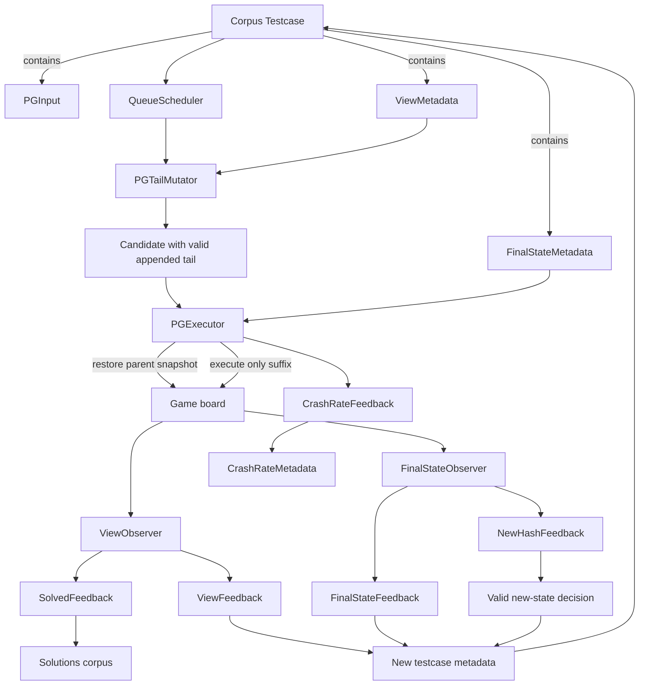

--

Useful commands:

```bash
cargo check
cargo test <test-name> -- --nocapture
cargo doc --open
cargo tree
rg "symbol_name" .
rg "trait TraitName" ~/.cargo/registry/src
rg "method_name::<" ~/.cargo/registry/src
```

--

## 28. Final Principles

1. Types are executable documentation.
2. Metadata needs an explicit producer and consumer.
3. Observer data is temporary unless copied into testcase metadata.
4. Feedback truth values and side effects are distinct.
5. Short-circuit composition can skip required callbacks.
6. Semantic mutators are often dramatically better than blind random mutation.
7. Snapshot execution is correct only when the parent is a verified prefix.
8. Borrowed framework data often needs to be converted into owned local data before mutating state.
9. Read tests and call sites, not only definitions.
10. Experienced engineers do not know everything in advance. They reduce uncertainty systematically.

