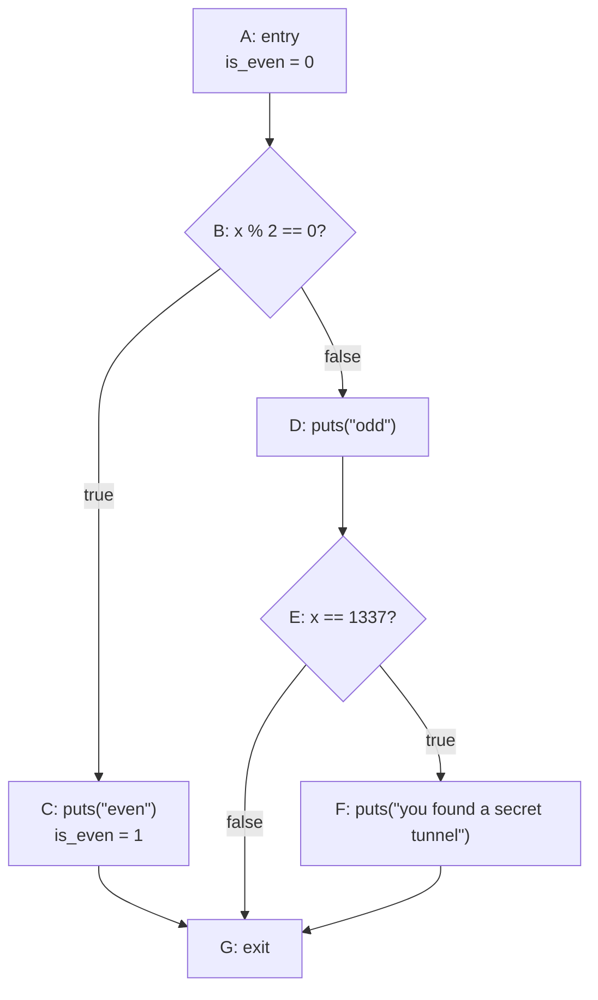
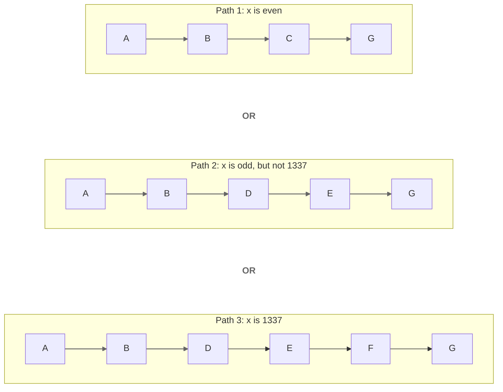
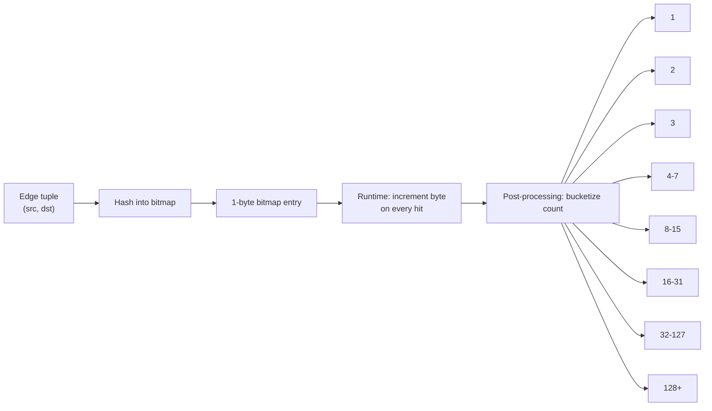

+++
title = 'do we need a new coverage map ?'
date = '2026-06-08T23:55:55-07:00'
draft = true
math = true
+++

AFL uses coverage feedback to decide whether an input is interesting. In classic AFL-style fuzzing, the target is instrumented so each execution updates a shared-memory coverage bitmap. That bitmap is then used by the fuzzer to decide whether the input exercised behavior that looks new.

At a high level, the instrumentation is meant to capture:

1. which control-flow edges were taken; 
2. and a coarse approximation of how often each edge was taken.

The AFL/AFL++ documentation describes the injected logic like this:

```
  cur_location = <COMPILE_TIME_RANDOM>;
  shared_mem[cur_location ^ prev_location]++;
  prev_location = cur_location >> 1;
```

It is also fair to ask how AFL distinguishes `(A, B)` from `(B, A)`, since `A ^ B == B ^ A`. The `prev_location = cur_location >> 1` step is there to preserve directionality, so the tuple for `A -> B` does not collapse into the tuple for `B -> A`. It also helps distinguish tight loops such as `A -> A` from `B -> B`.

A 64 kB shared-memory region is passed to the instrumented program, and the program increments bytes in that region while it runs. AFL then reads that bitmap after execution and uses it as feedback for seed selection.

Conceptually, each bitmap update corresponds to an edge tuple of the form `(source, destination)`, because the current location is XORed with the previous one. However, the map is only an approximation: it is a hashed bitmap, not a perfect table, so different edge tuples can collide into the same byte.

The 64 kB size is a deliberate trade-off. According to the AFL design notes, it is small enough to fit comfortably in L2 cache and small enough for the fuzzer to analyze in a matter of microseconds, while still keeping collisions relatively infrequent for many real-world targets. This is why AFL uses a bitmap instead of storing an exact per-edge data structure keeping things space optimized as well. 

So if we have a program like the following:

```c
uint8_t is_even = 0;
if (x % 2 == 0) {
  puts("even");
  is_even = 1;
} else {
  puts("odd");
  if (x == 1337) {
    puts("you found a secret tunnel");
  }
}
```

The control-flow graph (CFG) will look like this:



Now there can be multiple execution paths, and each path produces a different set of tuples:



For those three paths, the edge tuples would look like this:

- `x` even: `(A, B)`, `(B, C)`, `(C, G)`
- `x` odd and `x != 1337`: `(A, B)`, `(B, D)`, `(D, E)`, `(E, G)`
- `x == 1337`: `(A, B)`, `(B, D)`, `(D, E)`, `(E, F)`, `(F, G)`

64KB bitmap, 1 byte per tuple, means 65,536 possible hashed slots. It's reasonable to think that for complex programs, the number of real edges can easily go beyond that, and yes, that's a fair concern. But here's the thing: collisions can happen, and AFL still works because it does not need a perfect execution trace. What it really wants is a fast way to notice new behavior. If an input helps expose something new, that's already a win.

The above only tells us which edges were taken. It still does not explain how AFL keeps track of how many times an edge was hit. And again, AFL does not really care about the exact number. It just wants a good enough signal that says: "this execution behaved a bit differently".

More concretely, each edge tuple hashes to one entry in AFL's 64 KB coverage bitmap. That bitmap entry is a single byte, and AFL uses it as an approximate hit counter for that tuple while the program is running.

That is where hit-count bucketing comes in. During execution, the bitmap byte for a tuple is incremented, but AFL does not treat every exact count as equally important. Instead, it groups counts into coarse buckets like:

- `1`
- `2`
- `3`
- `4-7`
- `8-15`
- `16-31`
- `32-127`
- `128+`

So if an edge was hit 67 times in one run and 69 times in another run, AFL treats that as the same bucket and does not get excited about it. But if that edge moves from `1` hit to `2` hits, or from `3` hits to `4-7`, that bucket transition can be treated as interesting.

This is the important bit: after execution, AFL maps the byte counter into one of these hit-count buckets and uses bucket transitions as part of the signal for new coverage. It is not trying to preserve "the exact truth" about edge counts forever. It is compressing the signal on purpose. Tiny differences matter more when the counts are small, and once the counts get large, AFL becomes more relaxed about the exact number. That keeps the feedback useful without making it noisy.

Another way to think about it is this: each edge tuple maps to one byte in the bitmap. While the target is running, that byte behaves like a counter and gets incremented. Later, AFL does not obsess over the exact value sitting in that byte. Instead, it classifies that value into one of 8 coarse hit-count buckets. So the byte is doing double duty: first as a cheap counter during execution, and then as a compact signal that says which approximate hit-count range this edge ended up in.



So when people say AFL tracks hit counts "approximately", this is what they mean. It is not trying to preserve the exact number forever. It is trying to preserve enough information to notice that an edge was hit in a meaningfully different way.

#### How to differentiate between old and new behavior ?

With all this information, one thing is still missing: history. We still need some data structure that remembers what AFL has already seen in previous runs.

That is where `virgin_bits` comes in. The current execution updates `trace_bits`, while AFL keeps another bitmap called `virgin_bits` to remember which tuple-and-bucket states have not been seen yet.

So now we have two bitmaps in play:

1. `trace_bits` - stores information about the current run,
2. `virgin_bits` - stores which coverage states are still unseen across all runs so far.

`virgin_bits` is initially filled with `0xFF` everywhere:

So:

```
11111111
11111111
11111111
...
```

This means every coverage state is still "virgin" (unseen).

During execution, `trace_bits` contains raw byte counters. Before AFL checks whether anything new happened, it classifies those counters into bucket-encoded values like this:

```
1 hit      -> 00000001
2 hits     -> 00000010
3 hits     -> 00000100
4-7 hits   -> 00001000
8-15 hits  -> 00010000
16-31 hits -> 00100000
32-127 hits -> 01000000
128+ hits  -> 10000000
```

So suppose edge `AB` hashes to slot `1337`, and during this run it executed `10` times. That falls into the `8-15` bucket, which is represented by `00010000`.

AFL now checks `virgin_bits[1337]`, which is currently `11111111`. Then it does something conceptually like this:

`if (trace_bits[1337] & virgin_bits[1337])`

This becomes non-zero:

`00010000 & 11111111 = 00010000`

That means AFL has seen a tuple/bucket combination that was still virgin, so this run discovered something new.

After that, AFL conceptually updates the history like this:

`virgin_bits[1337] &= ~trace_bits[1337]`

So the `8-15` bit gets cleared in `virgin_bits`. The next time the same edge lands in the same bucket, that check will no longer fire for this slot. In other words, AFL is not just remembering "I have seen this edge", it is remembering "I have already seen this edge reach this approximate hit-count bucket".

References:
- [AFL whitepaper](https://lcamtuf.coredump.cx/afl/technical_details.txt)
- [AFL++ technical details](https://aflplus.plus/docs/technical_details/)
- https://www.cs.ucr.edu/~heng/pubs/afl-sensitive.pdf
